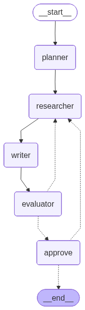

# 🔍 Deep Research Agent

An intelligent, self-correcting AI research assistant built on **LangGraph**. It transforms a high-level research question into a comprehensive, human-approved report through an iterative, multi-agent style loop.

---

## 🏗️ Architecture & Visual Flow

Below is the graph visualization of the agent's workflow, representing the flow of states and control:



---

## 🔄 The Research Lifecycle (How It Works)

Rather than generating a report in a single pass, the agent moves through a series of specialized nodes. In doing so, it leverages key advanced LangGraph and LangChain patterns:

### 1. Persistent Thread Initiation
*   **The Flow:** The process begins with a user-defined topic.
*   **Under the Hood:** A workspace is initialized under a unique `thread_id`. We leverage LangGraph's native **`MemorySaver` Checkpointer** to provide full persistence. This allows the agent to maintain state history, pause execution, support multi-user threads, and easily resume sessions if interrupted or stopped.

### 2. Planning with Structured Output
*   **The Flow:** The **Planner** node analyzes the topic and breaks it down into three specific sub-questions to guide the research.
*   **Under the Hood:** To guarantee a strict and reliable execution path, the planner utilizes Pydantic validation via LangChain's **`with_structured_output(ResearchPlan)`**. This ensures the agent returns a cleanly structured object containing the sub-questions and the planning reasoning, rather than unstructured text.

### 3. Tool-Assisted Deep Research (ReAct Loop)
*   **The Flow:** The **Researcher** node cycles through each sub-question, seeking detailed facts and answers.
*   **Under the Hood:** 
    *   **Agentic Tool Invocation:** The model is equipped with a suite of custom **LangChain `@tool` utilities** (`search_web`, `calculate`, `read_file`) which it calls dynamically.
    *   **Custom State Reducers:** As new information is gathered across multiple sub-questions and iterations, we prevent data from being overwritten by using a **custom state reducer** (`merge_research`). This custom reducer intelligently merges dictionary contents, extending list records for existing keys and appending new ones.

### 4. Synthesis & Drafting
*   **The Flow:** The **Writer** node takes all accumulated facts and compiles them into a cohesive Markdown report.
*   **Under the Hood:** The node dynamically adapts its instructions based on the current state. If a draft already exists and the evaluator has suggested enhancements, the writer targets only those specific gaps, refining the report iteratively rather than writing it from scratch.

### 5. Automated Evaluation & Self-Correction
*   **The Flow:** The **Evaluator** node critiques the drafted report, assigning a score (1–10) and feedback.
*   **Under the Hood:** 
    *   Using structured output (`with_structured_output(Evaluation)`), a strict evaluation agent scores the draft.
    *   **Conditional Routing:** The graph runs a router (`route_after_evaluator`) checking if the score is $\ge 8$ or if the maximum attempts (3) have been reached. If not, the graph conditionally routes back to the **Researcher** with evaluation feedback to address specific gaps, establishing a self-correction loop.

### 6. Human-in-the-Loop Guardrail
*   **The Flow:** Once the automated check passes, the agent pauses for final human review.
*   **Under the Hood:**
    *   **Interrupts:** We use LangGraph's native **`interrupt()`** feature to halt execution and expose the draft report to the user.
    *   **Resume Commands:** The user can resume execution by sending a **`Command(resume=...)`** containing either an `"approve"` command (finishing the run), a `"reject"` command, or revision feedback (which sends the graph back to the **Researcher** node with the human's comments to refine the report further).

---

## 🛠️ Project Structure

*   [`main.py`](file:///d:/Personal_dev/Research-Agent/main.py): Entry point to configure parameters, compile the graph, run execution, and resume from interrupts.
*   [`src/config/`](file:///d:/Personal_dev/Research-Agent/src/config): Centralized setup and LLM client initialization (`llm_client.py`).
*   [`src/state/state.py`](file:///d:/Personal_dev/Research-Agent/src/state/state.py): Defines `ResearchState` and the custom state reducer `merge_research`.
*   [`src/schemas/schemas.py`](file:///d:/Personal_dev/Research-Agent/src/schemas/schemas.py): Pydantic validation schemas for planning and evaluation outputs.
*   [`src/tools/tools.py`](file:///d:/Personal_dev/Research-Agent/src/tools/tools.py): Core tools for searching web, calculator, and local file reading.
*   [`src/graph/graph.py`](file:///d:/Personal_dev/Research-Agent/src/graph/graph.py): Node definitions, routing logic, and compiled state graph.
*   [`src/utils/formatter.py`](file:///d:/Personal_dev/Research-Agent/src/utils/formatter.py): Standardized terminal styling and graph image generator (`save_graph_image`).

---

## 🚀 Getting Started

1.  **Configure Environment**:
    Create an `env/.env` file with your credentials:
    ```env
    NVIDIA_MODEL="meta/llama-3.1-70b-instruct"
    NVIDIA_API_KEY="your_api_key_here"
    NVIDIA_BASE_URL="https://integrate.api.nvidia.com/v1"
    ```
2.  **Install Dependencies**: Ensure you have `langgraph`, `langchain-nvidia-ai-endpoints`, `pydantic`, and `rich` installed.
3.  **Run the Agent**:
    ```bash
    python main.py
    ```